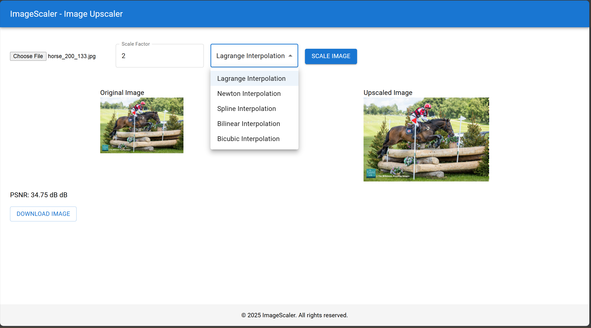

# ImageScaler Project



## Description

Dự án ImageScaler là một ứng dụng web cho phép người dùng phóng to (upscale) hình ảnh kỹ thuật số bằng các phương pháp nội suy khác nhau. Ứng dụng cung cấp giao diện để tải ảnh lên, chọn thuật toán nội suy (Lagrange, Newton, Spline, Bilinear, Bicubic), hệ số phóng đại, và xem kết quả ảnh đã phóng to cùng với chỉ số PSNR (Peak Signal-to-Noise Ratio) để đánh giá chất lượng.

## Overview

Dự án bao gồm hai thành phần chính:

1. **Backend (FastAPI)**: Xử lý logic cốt lõi, bao gồm việc nhận ảnh đầu vào, thực hiện các thuật toán nội suy được yêu cầu, tính toán PSNR, và trả về ảnh kết quả cùng các thông số liên quan.
2. **Frontend (React)**: Cung cấp giao diện người dùng (UI) thân thiện, cho phép người dùng tương tác với ứng dụng: tải ảnh lên, chọn tùy chọn, xem ảnh gốc và ảnh kết quả, và tải ảnh đã phóng to về máy.

## Features

- Phóng to ảnh sử dụng các phương pháp nội suy: Lagrange, Newton, Spline.
- Tích hợp các phương pháp nội suy phổ biến từ OpenCV: Bilinear, Bicubic.
- Tính toán chỉ số PSNR để so sánh chất lượng ảnh kết quả so với ảnh gốc được resize bằng phương pháp Nearest Neighbor.
- Giao diện web trực quan xây dựng bằng React và Material-UI.
- Cho phép người dùng tải lên ảnh định dạng phổ biến (JPG, PNG, ...).
- Hiển thị ảnh gốc và ảnh đã được phóng to song song để dễ so sánh.
- Cung cấp thông tin về thời gian xử lý và PSNR.
- Cho phép tải về ảnh kết quả.

## Interpolation Mechanism

Nội suy hình ảnh là quá trình ước tính giá trị màu của các pixel mới khi thay đổi kích thước ảnh (trong trường hợp này là phóng to). Thay vì chỉ sao chép các pixel hiện có, nội suy sử dụng các pixel lân cận trong ảnh gốc để tính toán giá trị màu hợp lý cho các pixel mới tại tọa độ tương ứng trong ảnh phóng to.

Trong dự án này, đối với các phương pháp Lagrange, Newton và Spline:

1. Với mỗi pixel `(i, j)` trong ảnh kết quả (ảnh phóng to), tọa độ tương ứng `(src_y, src_x)` trong ảnh gốc được xác định (`src_x = j / scale`, `src_y = i / scale`).
2. Một tập hợp các điểm lân cận theo chiều ngang (`x_points`) xung quanh `src_x` tại hàng `int(src_y)` trong ảnh gốc được chọn (thường là 4 điểm).
3. Giá trị màu (`y_points`) tại các `x_points` này được lấy cho từng kênh màu (R, G, B).
4. Hàm nội suy 1D (Lagrange, Newton, hoặc Spline) được áp dụng để ước tính giá trị màu tại `src_x` dựa trên `x_points` và `y_points`.
5. Quá trình này lặp lại cho tất cả các pixel trong ảnh kết quả và cho cả 3 kênh màu.

Các phương pháp Bilinear và Bicubic sử dụng các hàm được tối ưu hóa sẵn có trong thư viện OpenCV (`cv2.resize`).

## Interpolation Formulas

Dự án triển khai các công thức nội suy sau:

1. **Lagrange Interpolation**: Sử dụng đa thức Lagrange đi qua một tập hợp các điểm đã biết để ước tính giá trị tại một điểm mới. Công thức dựa trên việc xây dựng các đa thức cơ sở.
2. **Newton Interpolation**: Sử dụng đa thức Newton (dạng sai phân chia) đi qua các điểm đã biết. Thuận tiện cho việc thêm điểm mới mà không cần tính toán lại toàn bộ.
3. **Spline Interpolation (Cubic)**: Sử dụng các đa thức bậc ba khác nhau trên từng đoạn nhỏ giữa các điểm dữ liệu, đảm bảo tính trơn tru tại các điểm nối. Dự án sử dụng `scipy.interpolate.CubicSpline`.
4. **Bilinear Interpolation**: Nội suy tuyến tính theo cả hai chiều (ngang và dọc). Thực hiện bởi `cv2.resize` với cờ `interpolation=cv2.INTER_LINEAR`.
5. **Bicubic Interpolation**: Nội suy sử dụng đa thức bậc ba trên một vùng lân cận 4x4 pixel. Thường cho kết quả mịn hơn Bilinear. Thực hiện bởi `cv2.resize` với cờ `interpolation=cv2.INTER_CUBIC`.

Chi tiết về cách triển khai các công thức Lagrange, Newton và Spline có thể xem trong file `interpolation.py`.

## Technology Stack

- **Backend**:
    - Python 3.x
    - FastAPI: Framework web hiệu năng cao.
    - Uvicorn: ASGI server để chạy FastAPI.
    - NumPy: Thư viện tính toán khoa học, xử lý mảng đa chiều (hình ảnh).
    - SciPy: Thư viện khoa học, sử dụng cho Spline interpolation.
    - Pillow (PIL Fork): Thư viện xử lý ảnh (đọc, ghi, chuyển đổi).
    - OpenCV-Python (`cv2`): Thư viện thị giác máy tính, sử dụng cho Bilinear/Bicubic resize và tính toán PSNR.
    - python-multipart: Cần thiết cho FastAPI để xử lý dữ liệu form (upload file).
- **Frontend**:
    - React: Thư viện JavaScript để xây dựng giao diện người dùng.
    - Axios: Thư viện HTTP client để gọi API từ frontend.
    - Material-UI (`@mui/material`): Bộ công cụ UI React theo phong cách Material Design.
    - JavaScript (ES6+)
    - CSS

## Project Structure

```
ImageScaler/
├── backend/
│   ├── interpolation.py       # Chứa các hàm nội suy và PSNR
│   ├── app.py                 # Định nghĩa FastAPI app, routes, middleware
│   ├── main.py                # Điểm khởi chạy server backend
│   ├── requirements.txt       # Danh sách thư viện Python cần cài đặt
│   └── output/                # Thư mục (tự tạo) chứa ảnh kết quả
│
└── frontend/      # Thư mục chứa code frontend React
    ├── public/
    ├── src/
    │   ├── components/        # Các thành phần UI (Header, Upload, Result, Footer)
    │   │   ├── Header.js
    │   │   ├── UploadSection.js
    │   │   ├── ResultSection.js
    │   │   └── Footer.js
    │   ├── App.js             # Component chính của ứng dụng
    │   ├── App.css            # CSS styling chung
    │   └── index.js           # Điểm vào của ứng dụng React
    ├── package.json           # Thông tin dự án và danh sách dependencies Node.js
    └── ...                    # Các file cấu hình khác (babel, eslint, ...)

```

## Dependencies Installation

### Backend

1. Di chuyển vào thư mục backend:
    
    ```bash
    cd backend
    ```
    
2. (Khuyến nghị) Tạo và kích hoạt môi trường ảo:
    
    ```bash
    python -m venv venv
    # Windows
    venv\\Scripts\\activate
    # macOS/Linux
    source venv/bin/activate
    ```
    
3. Cài đặt các thư viện Python cần thiết:
    
    ```bash
    pip install -r requirements.txt
    ```
    

### Frontend

1. Di chuyển vào thư mục frontend:
    
    ```bash
    cd ../frontend
    # Hoặc cd /path/to/frontend nếu bạn ở thư mục khác
    ```
    
2. Cài đặt các gói Node.js cần thiết:
    
    ```bash
    npm install axios @mui/material @emotion/react @emotion/styled
    ```
    

## Running the Project

### 1. Run Backend Server

1. Đảm bảo bạn đang ở trong thư mục `backend` và đã kích hoạt môi trường ảo (nếu có).
2. Khởi chạy server FastAPI bằng Uvicorn:
Hoặc sử dụng reload để tự động cập nhật khi có thay đổi code:
    
    ```bash
    python main.py
    ```
    
    ```bash
    uvicorn main:app --reload --host 0.0.0.0 --port 8000
    ```
    
3. Server sẽ chạy tại `http://localhost:8000`. Bạn có thể truy cập `http://localhost:8000/docs` để xem giao diện Swagger UI của API.

### 2. Run Frontend Application

1. Mở một terminal khác và di chuyển vào thư mục `frontend`.
2. **Quan trọng**: Mở file `src/components/UploadSection.js` và đảm bảo rằng biến `API_URL` (hoặc URL được sử dụng trong `axios.post`) trỏ đúng đến địa chỉ backend của bạn. Nó phải là `http://localhost:8000/upscale`.
    
    ```jsx
    // Trong UploadSection.js, tìm dòng gọi axios.post và đảm bảo URL đúng:
    const API_URL = "<http://localhost:8000>"; // Hoặc đặt URL trực tiếp trong axios
    
    // ...
    
    const handleScaleImage = async () => {
        // ...
        try {
          // Sửa URL ở đây nếu cần
          const response = await axios.post(`${API_URL}/upscale`, formData, {
             // responseType: 'blob' // Bỏ responseType: 'blob' vì API trả về JSON
          });
    
          // Xử lý response JSON từ backend
          const resultData = JSON.parse(response.data.result);
          setUpscaledImage(API_URL + response.data.image_path); // Lấy URL đầy đủ
          setPsnr(resultData.metrics.psnr); // Lấy PSNR từ resultData
    
        } catch (error) {
          console.error('Error scaling image:', error);
          // Thêm xử lý hiển thị lỗi cho người dùng
        }
        // ...
    };
    ```
    
3. Khởi chạy ứng dụng React:
    
    ```bash
    npm start
    ```
    
4. Ứng dụng Frontend sẽ tự động mở trong trình duyệt của bạn tại `http://localhost:3000` (hoặc một cổng khác nếu 3000 đã được sử dụng).

## API Endpoints

### `/upscale`

- **Method**: `POST`
- **Description**: Tải lên ảnh, chọn phương pháp nội suy và hệ số phóng đại để nhận về ảnh đã phóng to và các thông số.
- **Request Body**: `multipart/form-data`
    - `file`: File ảnh cần xử lý (UploadFile).
    - `scale_factor`: Hệ số phóng đại (float, ví dụ: 2.0, 3.5). Mặc định là 2.0.
    - `method`: Tên phương pháp nội suy (string: 'lagrange', 'newton', 'spline', 'bilinear', 'bicubic'). Mặc định là 'lagrange'.
- **Response**: `JSON`
    - `message`: Thông báo trạng thái (string).
    - `result`: Một chuỗi JSON chứa thông tin chi tiết (string).
        - `output_image`: Đường dẫn file ảnh kết quả trên server (string).
        - `scale_factor`: Hệ số phóng đại đã dùng (float).
        - `method`: Phương pháp đã dùng (string).
        - `metrics`:
            - `psnr`: Chỉ số PSNR (string, ví dụ: "35.12 dB").
            - `processing_time`: Thời gian xử lý (string, ví dụ: "0.523 seconds").
    - `image_path`: Đường dẫn tương đối để truy cập ảnh từ frontend (string, ví dụ: `/output/upscaled_image.png`).

### `/download/{filename}`

- **Method**: `GET`
- **Description**: Tải về file ảnh đã xử lý từ thư mục `output`.
- **Path Parameter**:
    - `filename`: Tên file ảnh cần tải (string, ví dụ: `upscaled_image.png`).
- **Response**: File ảnh.

### `/output/{filename}`

- **Method**: `GET` (thông qua StaticFiles)
- **Description**: Truy cập trực tiếp file ảnh đã xử lý (dùng để hiển thị trong thẻ `` ở frontend).
- **Path Parameter**:
    - `filename`: Tên file ảnh (string).
- **Response**: File ảnh.

## Usage

1. Chạy cả Backend và Frontend theo hướng dẫn ở mục "Running the Project".
2. Mở trình duyệt và truy cập địa chỉ của Frontend (thường là `http://localhost:3000`).
3. Nhấn nút "Choose File" (hoặc tương tự) để chọn một file ảnh từ máy tính của bạn. Ảnh gốc sẽ được hiển thị.
4. Nhập "Scale Factor" (hệ số phóng đại) mong muốn.
5. Chọn "Interpolation Method" (phương pháp nội suy) từ danh sách thả xuống.
6. Nhấn nút "Scale Image".
7. Chờ quá trình xử lý hoàn tất. Ảnh đã phóng to sẽ hiển thị bên cạnh ảnh gốc, cùng với chỉ số PSNR và thời gian xử lý.
8. Nếu muốn lưu ảnh kết quả, nhấn nút "Download Image".

---